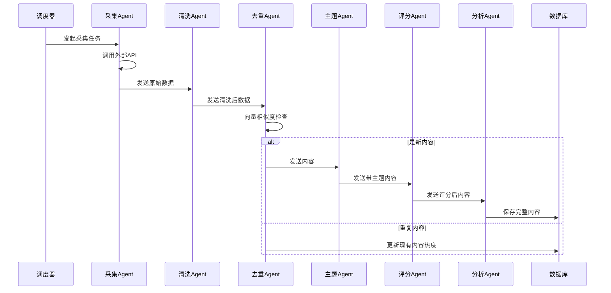

# AI 前沿情报聚合与推荐系统 - 多 Agent 架构

## 1. Agent 系统概述

本系统采用多 Agent 协作架构，通过专业化的智能体分工完成信息采集、处理、分析、推荐等全流程任务。

### 核心设计原则
- **专业化分工**: 每个 Agent 专注于特定任务，提高效率和质量
- **松耦合协作**: Agent 间通过消息队列通信，便于扩展和维护
- **可观测性**: 完整的任务追踪、日志记录和状态监控
- **人工干预点**: 关键节点支持人工审核和干预

## 2. Agent 类型与职责

### 2.1 数据采集层 Agents

#### GitHub Agent
**职责**:
- 抓取 GitHub Trending 项目
- 监控高星项目更新
- 追踪特定主题项目的 Star 增长
- 获取项目 README、Issue、PR 动态

**工具调用**:
- GitHub REST API / GraphQL API
- Octokit SDK

**输出**: GitHubProject 实体

#### RSS Agent
**职责**:
- 监控 RSS 源更新
- 解析 RSS/Atom 格式
- 提取文章元数据和内容

**工具调用**:
- rss-parser
- cheerio (HTML 解析)

**输出**: NewsItem 实体

#### Hacker News Agent
**职责**:
- 获取 HN 首页和热门故事
- 提取评论和讨论热度
- 识别 AI 相关内容

**工具调用**:
- Hacker News API
- Algolia Search API

**输出**: NewsItem 实体

#### Hugging Face Agent
**职责**:
- 获取最新模型发布
- 监控热门模型和 Space
- 提取模型卡片信息

**工具调用**:
- Hugging Face Hub API
- huggingface_hub SDK

**输出**: Model 实体

#### arXiv Agent
**职责**:
- 抓取最新 AI 相关论文
- 提取论文元数据和摘要
- 监控高引论文

**工具调用**:
- arXiv API
- arXiv.py (或自定义解析)

**输出**: NewsItem 实体 (论文类型)

### 2.2 内容处理层 Agents

#### 内容清洗 Agent
**职责**:
- 去除 HTML 标签和广告
- 标准化文本格式
- 提取纯文本内容
- 语言检测

**工具调用**:
- cheerio
- natural (NLP 工具库)
- franc (语言检测)

#### 去重 Agent
**职责**:
- 计算内容相似度 (余弦相似度)
- 识别重复内容
- 合并相关内容
- 建立内容关联

**工具调用**:
- OpenAI Embeddings API
- pgvector (向量相似度搜索)

#### 主题识别 Agent
**职责**:
- 自动分类内容主题
- 提取关键词和标签
- 关联到预定义主题

**工具调用**:
- LLM API (GPT-4 / Claude)
- zero-shot classification

#### 质量评分 Agent
**职责**:
- 评估内容质量 (0-100)
- 多维度评分:
  - 来源可信度
  - 内容深度
  - 时效性
  - 影响力指标

**工具调用**:
- LLM API
- 规则引擎

### 2.3 深度分析层 Agents

#### 深度解读 Agent
**职责**:
- 生成内容摘要
- 提取核心观点
- 分析技术亮点
- 评估影响范围

**Prompt 模板**:
```
请分析以下内容并提供结构化解读：
{content}

请按以下格式输出 JSON:
{
  "coreContent": "核心内容概要",
  "whyImportant": "为什么重要",
  "targetAudience": ["受众1", "受众2"],
  "techHighlights": ["技术亮点1", "技术亮点2"],
  "actionRecommendation": "try_now|bookmark|follow|skip",
  "comparison": "与现有方案对比",
  "impact": "潜在影响",
  "valueAssessment": {
    "personal": 0-10,
    "team": 0-10,
    "product": 0-10,
    "business": 0-10
  }
}
```

#### 趋势分析 Agent
**职责**:
- 识别上升趋势话题
- 计算话题热度
- 预测趋势发展
- 生成趋势报告

**工具调用**:
- 时间序列分析
- 热度算法

### 2.4 推荐与个性化层 Agents

#### 推荐 Agent
**职责**:
- 基于用户兴趣推荐
- 协同过滤推荐
- 内容相似度推荐
- 热门内容推荐

**输入**:
- 用户兴趣画像
- 用户交互历史
- 内容特征向量

#### 用户偏好学习 Agent
**职责**:
- 分析用户行为
- 更新兴趣画像
- 调整推荐权重
- 发现新兴趣点

**学习信号**:
- 点击/查看时长
- 收藏/分享
- 搜索关键词
- 显式反馈

#### 每日简报 Agent
**职责**:
- 精选当日重要内容
- 生成个性化简报
- 总结趋势变化
- 格式化输出

**输出格式**:
- 头条要闻 (3-5条)
- 热门话题
- 值得关注的项目
- 趋势观察

### 2.5 协调整层

#### 任务调度 Agent
**职责**:
- 管理采集任务队列
- 分配任务给专用 Agent
- 监控任务执行状态
- 处理失败重试

#### 工作流 Agent
**职责**:
- 编排多 Agent 工作流
- 管理任务依赖关系
- 处理异常和回滚
- 维护执行上下文

## 3. Agent 通信机制

### 3.1 消息队列架构

```
┌─────────────┐
│ Task Queue  │ (BullMQ)
└──────┬──────┘
       │
       ├─→ Fetch Queue
       ├─→ Process Queue
       ├─→ Analysis Queue
       └─→ Recommendation Queue
```

### 3.2 消息格式

```typescript
interface AgentMessage {
  id: string;
  type: 'task' | 'result' | 'error' | 'status';
  taskType: string;
  payload: any;
  priority: number;
  timestamp: Date;
  metadata: {
    sourceAgent?: string;
    targetAgent?: string;
    correlationId?: string;
    retryCount?: number;
  };
}

interface TaskResult {
  success: boolean;
  data?: any;
  error?: string;
  duration: number;
}
```

### 3.3 工作流示例



## 4. 上下文与记忆管理

### 4.1 短期记忆 (Redis)

```typescript
interface AgentContext {
  sessionId: string;
  currentTask: any;
  recentResults: any[];
  workingMemory: Map<string, any>;
  expiration: Date;
}
```

### 4.2 长期记忆 (PostgreSQL)

```typescript
interface AgentMemory {
  id: string;
  agentType: string;
  memoryType: 'fact' | 'experience' | 'preference';
  content: any;
  embedding: vector;
  importance: number;
  timestamp: Date;
  accessCount: number;
  lastAccess: Date;
}
```

### 4.3 检索增强 (RAG)

Agent 在执行任务时可从长期记忆中检索相关信息：
- 使用向量相似度搜索
- 按重要性和时效性加权
- 合并到当前上下文中

## 5. 人工审核与干预

### 5.1 审核队列

关键操作前进入人工审核：
- 高影响内容发布
- 质量评分异常
- 趋势判断争议
- 系统决策变更

### 5.2 审核界面

提供管理后台功能：
- 查看待审核内容
- 批准/拒绝/修改
- 调整评分和标签
- 添加人工备注

## 6. 监控与可观测性

### 6.1 指标收集

每个 Agent 记录：
- 任务执行次数
- 成功率/失败率
- 平均执行时间
- 吞吐量

### 6.2 日志记录

结构化日志包含：
- 任务 ID 和类型
- 输入输出数据
- 执行步骤
- 错误堆栈
- 性能指标

### 6.3 分布式追踪

使用 OpenTelemetry 实现：
- 端到端任务追踪
- 性能瓶颈分析
- 依赖关系可视化
