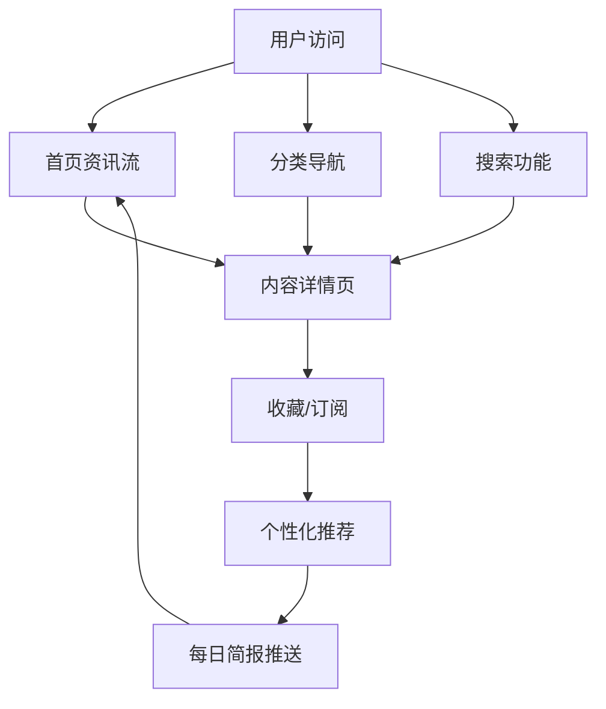

# AI 前沿情报聚合与推荐系统 - 产品需求文档

## 1. Product Overview
AI 前沿情报聚合与推荐系统是一个智能化的信息聚合平台，持续获取最新、最广、最有深度、最高质量的 AI 与技术前沿资讯，支持可视化展示、智能筛选、长期追踪和自定义订阅。
- 解决用户在海量信息中筛选高质量 AI 资讯的痛点，帮助 AI 从业者、研究者、开发者保持技术前沿敏感度
- 打造可持续运行的智能情报平台，成为 AI 领域的信息枢纽和决策辅助工具

## 2. Core Features

### 2.1 User Roles
| Role | Registration Method | Core Permissions |
|------|---------------------|------------------|
| Guest User | None | 浏览公开内容，使用基础搜索 |
| Registered User | Email/Google/GitHub | 完整功能，个性化订阅，收藏归档 |
| Admin User | Invite-only | 内容审核，系统管理，数据源配置 |

### 2.2 Feature Module
1. **首页资讯流**: 综合推荐，最新动态，热门趋势，分类导航
2. **分类频道页**: GitHub 动向、模型专区、Agent 专题、教育科技等垂直频道
3. **热门趋势页**: 实时热点，周榜/月榜，趋势分析可视化
4. **GitHub 开源项目榜单**: Trending，Stars 增长，成熟项目推荐
5. **模型榜单页**: 大模型对比，性能评测，更新动态
6. **Agent 专题页**: Agent 架构，多 Agent 协作，工具调用最佳实践
7. **订阅与过滤器配置**: 自定义主题，来源偏好，推荐风格
8. **项目详情页**: 深度分析，技术解读，相关推荐，评论互动
9. **每日/每周情报简报**: 智能摘要，重点推荐，趋势回顾
10. **搜索与高级检索**: 关键词搜索，多维度筛选，时间范围
11. **收藏与知识归档**: 稍后读，标签分类，笔记功能
12. **管理后台**: 内容审核，数据源管理，用户管理，系统监控

### 2.3 Page Details
| Page Name | Module Name | Feature description |
|-----------|-------------|---------------------|
| 首页 | 综合资讯流 | 智能排序，无限滚动，快捷筛选 |
| 首页 | 热门趋势卡片 | 实时热点，点击跳转详细分析 |
| 首页 | 分类导航 | 快速切换垂直频道 |
| GitHub 榜单 | Trending 列表 | 按语言、时间范围筛选 |
| 模型榜单 | 模型对比表 | 性能指标，适用场景，更新时间 |
| 订阅配置 | 主题管理 | 添加/删除/编辑追踪主题 |
| 详情页 | 深度解读 | AI 生成的技术分析和价值评估 |
| 搜索页 | 高级筛选 | 来源、时间、主题、质量分多维过滤 |
| 收藏页 | 知识归档 | 文件夹组织，标签管理，搜索功能 |

## 3. Core Process
用户访问系统 → 浏览首页推荐或使用搜索 → 发现感兴趣内容 → 查看深度分析 → 收藏/订阅相关主题 → 接收每日/每周推送 → 持续追踪技术动态

## 4. User Interface Design

### 4.1 Design Style
- **主色调**: 深蓝色 (#1e40af) 代表科技感，辅以明亮的青色 (#06b6d4) 作为强调色
- **辅助色**: 中性灰 (#6b7280) 用于文字，浅灰 (#f3f4f6) 用于背景
- **按钮风格**: 圆角矩形，轻微阴影，hover 时有微妙的颜色变化和缩放效果
- **字体**: Inter 字体族，标题 20-24px，正文 14-16px，小字 12px
- **布局风格**: 卡片式布局，清晰的信息层级，充足的留白
- **图标风格**: 使用 Heroicons/Phosphor Icons，简洁现代的线性图标

### 4.2 Page Design Overview
| Page Name | Module Name | UI Elements |
|-----------|-------------|-------------|
| 首页 | 资讯流卡片 | 标题、来源、时间、摘要、标签、质量分、互动按钮 |
| 首页 | 热门趋势 | 渐变色背景卡片，趋势图标，热度指标 |
| 分类频道 | 侧边栏导航 | 折叠式主题菜单，计数徽章 |
| 详情页 | 头部信息 | 大标题、来源链接、发布时间、作者信息 |
| 详情页 | 深度分析 | 分章节展示，重点内容高亮，图表可视化 |
| 搜索页 | 筛选面板 | 多条件组合筛选，实时更新结果 |
| 订阅配置 | 开关控件 | 直观的 toggle 开关，滑块调节，实时预览 |

### 4.3 Responsiveness
- Desktop-first 设计，优先优化 1280px+ 大屏幕体验
- 适配平板 (768px-1024px)：侧边栏收起为汉堡菜单，卡片列数减少
- 适配手机 (<768px)：单列布局，简化导航，优化触摸目标大小
- 触摸优化：按钮最小 44px，增加点击区域，支持手势操作

### 4.4 Information Visualization
- **趋势图表**: 使用 Recharts 绘制热度趋势折线图
- **模型对比**: 雷达图展示多维度性能对比
- **主题分布**: 词云或饼图展示热门主题
- **时间线**: 追踪同一事件的发展脉络
- **质量评分**: 星级或进度条可视化展示内容质量
