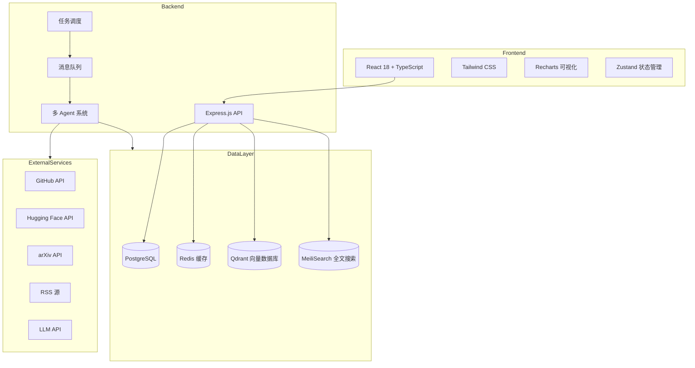
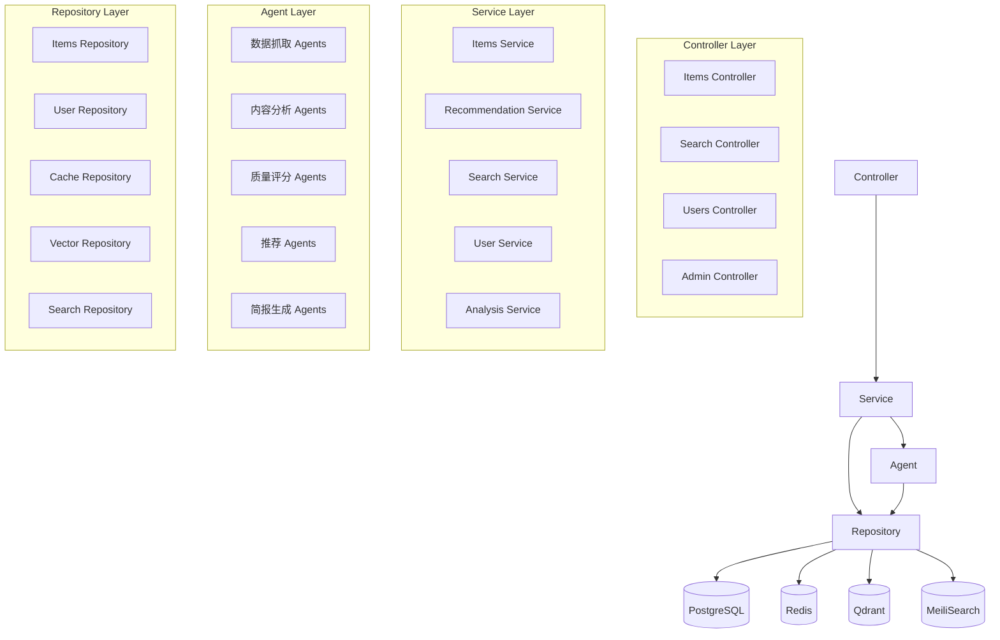
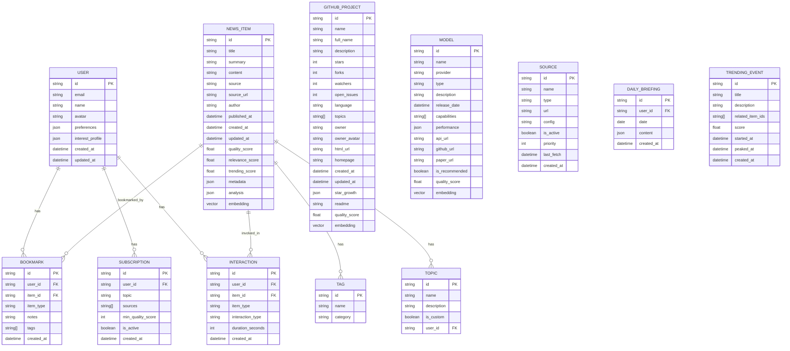

# AI 前沿情报聚合与推荐系统 - 技术架构文档

## 1. Architecture Design



## 2. Technology Description

### 技术选型理由

- **前端**: React 18 + TypeScript + Vite - 生态成熟，开发体验好，类型安全
- **样式**: Tailwind CSS - 快速构建现代化 UI，响应式设计友好
- **状态管理**: Zustand - 轻量级，简单易用，适合中小型应用
- **可视化**: Recharts - 基于 React 的图表库，功能强大且灵活
- **后端**: Express.js - 轻量级 Node.js 框架，灵活易扩展
- **数据库**: PostgreSQL - 功能强大的关系型数据库，支持 JSON、向量扩展
- **缓存**: Redis - 高性能缓存，用于会话、热门数据、队列
- **向量数据库**: Qdrant - 开源向量数据库，用于语义搜索和推荐
- **搜索引擎**: MeiliSearch - 开源全文搜索引擎，快速易用
- **任务调度**: node-cron + BullMQ - 定时任务和消息队列
- **LLM 集成**: OpenAI/Anthropic API - 用于内容分析、摘要生成、质量评分

### 完整技术栈
- **Frontend**: React@18 + TypeScript + Vite + Tailwind CSS@3 + Zustand + Recharts
- **Backend**: Node.js + Express@4 + TypeScript
- **Database**: PostgreSQL 15 + pgvector
- **Cache**: Redis 7
- **Vector DB**: Qdrant
- **Search Engine**: MeiliSearch
- **Queue**: BullMQ
- **Scheduler**: node-cron
- **Auth**: Supabase Auth / JWT
- **Deployment**: Docker + Docker Compose

## 3. Route Definitions

| Route | Purpose |
|-------|---------|
| / | 首页 - 综合资讯流 |
| /trending | 热门趋势 |
| /github | GitHub 榜单 |
| /models | 模型榜单 |
| /agents | Agent 专题 |
| /education | 教育科技 |
| /search | 搜索页面 |
| /item/:id | 内容详情页 |
| /dashboard | 用户仪表板 |
| /subscriptions | 订阅配置 |
| /bookmarks | 收藏归档 |
| /briefing | 每日简报 |
| /admin | 管理后台 |
| /api/items | 获取资讯列表 |
| /api/items/:id | 获取资讯详情 |
| /api/search | 搜索接口 |
| /api/recommendations | 个性化推荐 |
| /api/bookmarks | 收藏管理 |
| /api/subscriptions | 订阅管理 |

## 4. API Definitions

```typescript
// 核心数据类型
interface NewsItem {
  id: string;
  title: string;
  summary: string;
  content: string;
  source: string;
  sourceUrl: string;
  author?: string;
  publishedAt: Date;
  createdAt: Date;
  topics: string[];
  tags: string[];
  qualityScore: number;
  relevanceScore: number;
  trendingScore: number;
  metadata: Record<string, any>;
  analysis?: ContentAnalysis;
}

interface ContentAnalysis {
  coreContent: string;
  whyImportant: string;
  targetAudience: string[];
  techHighlights: string[];
  actionRecommendation: 'try_now' | 'bookmark' | 'follow' | 'skip';
  comparison: string;
  impact: string;
  valueAssessment: {
    personal: number;
    team: number;
    product: number;
    business: number;
  };
}

interface GitHubProject {
  id: string;
  name: string;
  fullName: string;
  description: string;
  stars: number;
  forks: number;
  watchers: number;
  openIssues: number;
  language: string;
  topics: string[];
  owner: string;
  ownerAvatar: string;
  htmlUrl: string;
  homepage: string;
  createdAt: Date;
  updatedAt: Date;
  starGrowth: {
    day: number;
    week: number;
    month: number;
  };
  readme?: string;
  qualityScore: number;
}

interface Model {
  id: string;
  name: string;
  provider: string;
  type: 'closed' | 'open' | 'multimodal' | 'code' | 'agent';
  description: string;
  releaseDate: Date;
  capabilities: string[];
  performance: {
    mmlu?: number;
    humaneval?: number;
    gsm8k?: number;
    [key: string]: number | undefined;
  };
  apiUrl?: string;
  githubUrl?: string;
  paperUrl?: string;
  isRecommended: boolean;
  qualityScore: number;
}

interface User {
  id: string;
  email: string;
  name?: string;
  avatar?: string;
  preferences: UserPreferences;
  subscriptions: string[];
  bookmarks: string[];
  readHistory: string[];
  interestProfile: InterestProfile;
}

interface UserPreferences {
  topics: string[];
  excludedTopics: string[];
  sources: string[];
  infoDensity: 'low' | 'medium' | 'high';
  refreshFrequency: '1h' | '6h' | '12h' | '24h';
  language: 'zh' | 'en';
  summaryLength: 'short' | 'medium' | 'long';
  recommendationStyle: 'balanced' | 'research' | 'product' | 'opensource' | 'practical';
  minQualityScore: number;
}

interface InterestProfile {
  topicWeights: Record<string, number>;
  sourceWeights: Record<string, number>;
  interactionHistory: Interaction[];
}

interface Interaction {
  itemId: string;
  type: 'view' | 'click' | 'bookmark' | 'share' | 'dismiss';
  timestamp: Date;
  duration?: number;
}

// API 响应类型
interface PaginatedResponse<T> {
  data: T[];
  pagination: {
    page: number;
    pageSize: number;
    total: number;
    totalPages: number;
  };
}

interface SearchFilters {
  query?: string;
  topics?: string[];
  sources?: string[];
  dateFrom?: Date;
  dateTo?: Date;
  minQualityScore?: number;
  itemType?: 'news' | 'github' | 'model' | 'paper';
}
```

## 5. Server Architecture Diagram



## 6. Data Model

### 6.1 Data Model Definition



### 6.2 Data Definition Language

```sql
-- Enable extensions
CREATE EXTENSION IF NOT EXISTS vector;
CREATE EXTENSION IF NOT EXISTS pg_trgm;
CREATE EXTENSION IF NOT EXISTS btree_gin;

-- Users table
CREATE TABLE users (
    id UUID PRIMARY KEY DEFAULT gen_random_uuid(),
    email VARCHAR(255) UNIQUE NOT NULL,
    name VARCHAR(255),
    avatar_url VARCHAR(500),
    preferences JSONB DEFAULT '{}'::jsonb,
    interest_profile JSONB DEFAULT '{}'::jsonb,
    created_at TIMESTAMP WITH TIME ZONE DEFAULT NOW(),
    updated_at TIMESTAMP WITH TIME ZONE DEFAULT NOW()
);

CREATE INDEX idx_users_email ON users(email);

-- News items table
CREATE TABLE news_items (
    id UUID PRIMARY KEY DEFAULT gen_random_uuid(),
    title VARCHAR(1000) NOT NULL,
    summary TEXT,
    content TEXT,
    source VARCHAR(255) NOT NULL,
    source_url VARCHAR(1000) NOT NULL,
    author VARCHAR(255),
    published_at TIMESTAMP WITH TIME ZONE,
    created_at TIMESTAMP WITH TIME ZONE DEFAULT NOW(),
    updated_at TIMESTAMP WITH TIME ZONE DEFAULT NOW(),
    quality_score REAL DEFAULT 0,
    relevance_score REAL DEFAULT 0,
    trending_score REAL DEFAULT 0,
    metadata JSONB DEFAULT '{}'::jsonb,
    analysis JSONB DEFAULT '{}'::jsonb,
    embedding vector(1536),
    UNIQUE(source, source_url)
);

CREATE INDEX idx_news_items_published_at ON news_items(published_at DESC);
CREATE INDEX idx_news_items_quality_score ON news_items(quality_score DESC);
CREATE INDEX idx_news_items_trending_score ON news_items(trending_score DESC);
CREATE INDEX idx_news_items_source ON news_items(source);
CREATE INDEX idx_news_items_embedding ON news_items USING hnsw (embedding vector_cosine_ops);

-- GitHub projects table
CREATE TABLE github_projects (
    id UUID PRIMARY KEY DEFAULT gen_random_uuid(),
    github_id BIGINT UNIQUE,
    name VARCHAR(255) NOT NULL,
    full_name VARCHAR(500) NOT NULL,
    description TEXT,
    stars INTEGER DEFAULT 0,
    forks INTEGER DEFAULT 0,
    watchers INTEGER DEFAULT 0,
    open_issues INTEGER DEFAULT 0,
    language VARCHAR(100),
    topics TEXT[],
    owner VARCHAR(255),
    owner_avatar VARCHAR(500),
    html_url VARCHAR(500) NOT NULL,
    homepage VARCHAR(500),
    github_created_at TIMESTAMP WITH TIME ZONE,
    github_updated_at TIMESTAMP WITH TIME ZONE,
    star_growth JSONB DEFAULT '{}'::jsonb,
    readme TEXT,
    quality_score REAL DEFAULT 0,
    embedding vector(1536),
    created_at TIMESTAMP WITH TIME ZONE DEFAULT NOW(),
    updated_at TIMESTAMP WITH TIME ZONE DEFAULT NOW()
);

CREATE INDEX idx_github_projects_stars ON github_projects(stars DESC);
CREATE INDEX idx_github_projects_language ON github_projects(language);
CREATE INDEX idx_github_projects_updated_at ON github_projects(github_updated_at DESC);
CREATE INDEX idx_github_projects_embedding ON github_projects USING hnsw (embedding vector_cosine_ops);

-- Models table
CREATE TABLE models (
    id UUID PRIMARY KEY DEFAULT gen_random_uuid(),
    name VARCHAR(255) NOT NULL,
    provider VARCHAR(255),
    type VARCHAR(50) NOT NULL,
    description TEXT,
    release_date DATE,
    capabilities TEXT[],
    performance JSONB DEFAULT '{}'::jsonb,
    api_url VARCHAR(500),
    github_url VARCHAR(500),
    paper_url VARCHAR(500),
    is_recommended BOOLEAN DEFAULT FALSE,
    quality_score REAL DEFAULT 0,
    embedding vector(1536),
    created_at TIMESTAMP WITH TIME ZONE DEFAULT NOW(),
    updated_at TIMESTAMP WITH TIME ZONE DEFAULT NOW()
);

CREATE INDEX idx_models_type ON models(type);
CREATE INDEX idx_models_release_date ON models(release_date DESC);
CREATE INDEX idx_models_is_recommended ON models(is_recommended);

-- Tags table
CREATE TABLE tags (
    id UUID PRIMARY KEY DEFAULT gen_random_uuid(),
    name VARCHAR(100) UNIQUE NOT NULL,
    category VARCHAR(100),
    created_at TIMESTAMP WITH TIME ZONE DEFAULT NOW()
);

-- Topics table
CREATE TABLE topics (
    id UUID PRIMARY KEY DEFAULT gen_random_uuid(),
    name VARCHAR(255) NOT NULL,
    description TEXT,
    is_custom BOOLEAN DEFAULT FALSE,
    user_id UUID REFERENCES users(id),
    created_at TIMESTAMP WITH TIME ZONE DEFAULT NOW()
);

-- Junction tables
CREATE TABLE news_item_tags (
    news_item_id UUID REFERENCES news_items(id) ON DELETE CASCADE,
    tag_id UUID REFERENCES tags(id) ON DELETE CASCADE,
    PRIMARY KEY (news_item_id, tag_id)
);

CREATE TABLE news_item_topics (
    news_item_id UUID REFERENCES news_items(id) ON DELETE CASCADE,
    topic_id UUID REFERENCES topics(id) ON DELETE CASCADE,
    PRIMARY KEY (news_item_id, topic_id)
);

-- Bookmarks table
CREATE TABLE bookmarks (
    id UUID PRIMARY KEY DEFAULT gen_random_uuid(),
    user_id UUID REFERENCES users(id) ON DELETE CASCADE,
    item_id UUID NOT NULL,
    item_type VARCHAR(50) NOT NULL,
    notes TEXT,
    tags TEXT[],
    created_at TIMESTAMP WITH TIME ZONE DEFAULT NOW(),
    UNIQUE(user_id, item_id, item_type)
);

CREATE INDEX idx_bookmarks_user_id ON bookmarks(user_id);
CREATE INDEX idx_bookmarks_created_at ON bookmarks(created_at DESC);

-- Subscriptions table
CREATE TABLE subscriptions (
    id UUID PRIMARY KEY DEFAULT gen_random_uuid(),
    user_id UUID REFERENCES users(id) ON DELETE CASCADE,
    topic VARCHAR(255) NOT NULL,
    sources TEXT[],
    min_quality_score REAL DEFAULT 0,
    is_active BOOLEAN DEFAULT TRUE,
    created_at TIMESTAMP WITH TIME ZONE DEFAULT NOW()
);

CREATE INDEX idx_subscriptions_user_id ON subscriptions(user_id);

-- Interactions table
CREATE TABLE interactions (
    id UUID PRIMARY KEY DEFAULT gen_random_uuid(),
    user_id UUID REFERENCES users(id) ON DELETE CASCADE,
    item_id UUID NOT NULL,
    item_type VARCHAR(50) NOT NULL,
    interaction_type VARCHAR(50) NOT NULL,
    duration_seconds INTEGER,
    created_at TIMESTAMP WITH TIME ZONE DEFAULT NOW()
);

CREATE INDEX idx_interactions_user_id ON interactions(user_id);
CREATE INDEX idx_interactions_created_at ON interactions(created_at DESC);

-- Sources table
CREATE TABLE sources (
    id UUID PRIMARY KEY DEFAULT gen_random_uuid(),
    name VARCHAR(255) NOT NULL,
    type VARCHAR(50) NOT NULL,
    url VARCHAR(1000),
    config JSONB DEFAULT '{}'::jsonb,
    is_active BOOLEAN DEFAULT TRUE,
    priority INTEGER DEFAULT 5,
    last_fetch TIMESTAMP WITH TIME ZONE,
    created_at TIMESTAMP WITH TIME ZONE DEFAULT NOW(),
    updated_at TIMESTAMP WITH TIME ZONE DEFAULT NOW()
);

-- Daily briefings table
CREATE TABLE daily_briefings (
    id UUID PRIMARY KEY DEFAULT gen_random_uuid(),
    user_id UUID REFERENCES users(id) ON DELETE CASCADE,
    date DATE NOT NULL,
    content JSONB DEFAULT '{}'::jsonb,
    created_at TIMESTAMP WITH TIME ZONE DEFAULT NOW(),
    UNIQUE(user_id, date)
);

-- Trending events table
CREATE TABLE trending_events (
    id UUID PRIMARY KEY DEFAULT gen_random_uuid(),
    title VARCHAR(500) NOT NULL,
    description TEXT,
    related_item_ids UUID[],
    score REAL DEFAULT 0,
    started_at TIMESTAMP WITH TIME ZONE,
    peaked_at TIMESTAMP WITH TIME ZONE,
    created_at TIMESTAMP WITH TIME ZONE DEFAULT NOW()
);

CREATE INDEX idx_trending_events_score ON trending_events(score DESC);
CREATE INDEX idx_trending_events_started_at ON trending_events(started_at DESC);

-- Update timestamps trigger function
CREATE OR REPLACE FUNCTION update_updated_at_column()
RETURNS TRIGGER AS $$
BEGIN
    NEW.updated_at = NOW();
    RETURN NEW;
END;
$$ language 'plpgsql';

-- Apply trigger to tables with updated_at
CREATE TRIGGER update_users_updated_at BEFORE UPDATE ON users
    FOR EACH ROW EXECUTE FUNCTION update_updated_at_column();

CREATE TRIGGER update_news_items_updated_at BEFORE UPDATE ON news_items
    FOR EACH ROW EXECUTE FUNCTION update_updated_at_column();

CREATE TRIGGER update_github_projects_updated_at BEFORE UPDATE ON github_projects
    FOR EACH ROW EXECUTE FUNCTION update_updated_at_column();

CREATE TRIGGER update_models_updated_at BEFORE UPDATE ON models
    FOR EACH ROW EXECUTE FUNCTION update_updated_at_column();

CREATE TRIGGER update_sources_updated_at BEFORE UPDATE ON sources
    FOR EACH ROW EXECUTE FUNCTION update_updated_at_column();

-- Insert default topics
INSERT INTO topics (name, description, is_custom) VALUES
    ('AI Research', '人工智能研究进展', false),
    ('Large Language Models', '大语言模型相关', false),
    ('Agents & Autonomy', '智能体与自治系统', false),
    ('Computer Vision', '计算机视觉', false),
    ('Multimodal AI', '多模态 AI', false),
    ('Open Source Projects', '开源项目', false),
    ('Education Tech', '教育科技', false),
    ('DevTools', '开发工具', false),
    ('Vibe Coding', '新型开发工作流', false),
    ('AI Policy', 'AI 政策与监管', false);

-- Insert default sources
INSERT INTO sources (name, type, url, priority) VALUES
    ('GitHub Trending', 'github', 'https://github.com/trending', 1),
    ('Hugging Face', 'huggingface', 'https://huggingface.co', 1),
    ('arXiv AI', 'arxiv', 'https://arxiv.org/list/cs.AI/recent', 2),
    ('OpenAI Blog', 'rss', 'https://openai.com/blog/rss.xml', 2),
    ('Hacker News', 'hackernews', 'https://news.ycombinator.com', 2),
    ('Product Hunt', 'producthunt', 'https://www.producthunt.com', 3);
```
